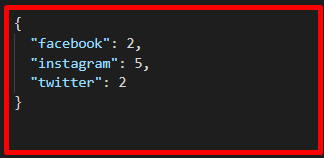

# **Social Media Activity Level**

## Introduction

This flask application provides an endpoint ```http://locahost:5000``` which calculate the activity level for three Social media sites, mainly:
- [twitter](https://takehome.io/twitter)
- [facebook](https://takehome.io/facebook)
- [instagram](https://takehome.io/instagram)

The activity level is a numeric indicator of the amount of content posted on a social network site.

Sample results:



## Quickstart

To get the project up and running, fork the repo and run:

```
pip install -r requirements.txt
flask --debug run
```
